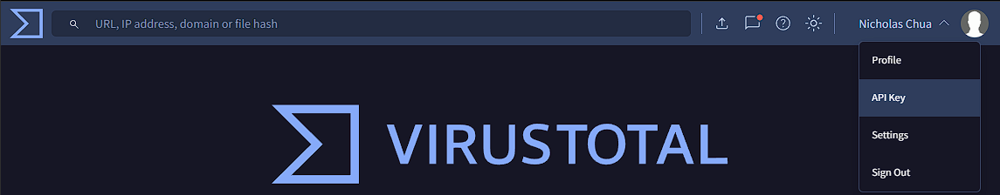
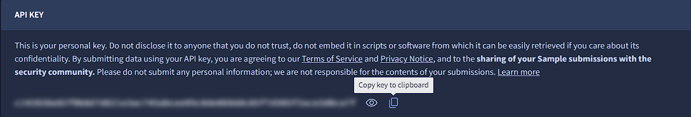
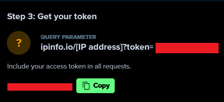

# SIEM OSINT Automation Project (SOAP)

SOAP is a collection of Python scripts that can be used to automate various OSINT tasks based on data from SIEMs. This helps improve response time and efficiency in incident response and threat hunting. These scripts are designed to work based on data outputted by SIEMs, such as IP addresses, domains, and hashes, rather than directly interfacing with the SIEM itself.

## Requirements

This project was tested on Python 3.12.3.

- Python 3.12+
- VirusTotal API key (free tier is sufficient)
- ipinfo.io API key (free tier is sufficient)
- secrets.json file containing API keys

## How to Get API Keys

### VirusTotal

1. Register for a free VirusTotal account: [https://www.virustotal.com/gui/join-us](https://www.virustotal.com/gui/join-us).


   
2. Once logged in, click on the top-right corner where your profile icon is and select "API Key". This will direct you to the [API Key page](https://www.virustotal.com/gui/my-apikey).



3. Under API Key, click on "Copy to clipboard" to copy your API key



### ipinfo.io

1. Register for a free IPinfo account: [https://ipinfo.io/signup](https://ipinfo.io/signup).


2. Once logged in and on the [home page](https://ipinfo.io/account/home), scroll down to `Step 3: Get your token`, and click on `Copy` to copy your API key.



### secrets.json

`Warning`: Do not share, upload, commit, or otherwise expose your API keys to the public. This can lead to unauthorized access and usage of your API keys. The `secrets.json` file is used to store your API keys in a secure manner, and has been added to the `.gitignore` file to prevent accidental exposure.

1. Create a `secrets.json` file in the root directory of the project with the following format:

```json
{
    "vt_api_key": "YOUR VIRUSTOTAL API KEY",
    "ip_info_api_key": "YOUR IPINFO API KEY"
}
```

2. Replace `YOUR VIRUSTOTAL API KEY` and `YOUR IPINFO API KEY` with the respective API keys you obtained in the previous steps.

3. Ensure that the `secrets.json` file is in the root directory of the project.

## File Structure

I assume the following file structure:

```plaintext
.
├───.venv
├───.gitignore
├───README.md
├───requirements.txt
├───LICENSE
├───ip_osint_json
│   ├───vt_ip_lookup.json (Output from vt_ip_osint.py)
│   └───ii_ip_lookup.json (Output from ii_ip_osint.py)
├───vt_ip_osint.py
├───ii_ip_osint.py
└───secrets.json
```

## Installation

1. Clone the repository:

```bash
git clone https://github.com/NicholasChua/siem_osint_automation.git
```

2. Create a virtual environment in the root directory of the project:

For Unix/Linux/MacOS:

```bash
python -m venv .venv
source env/bin/activate
```

For Windows:

```bash
python -m venv .venv
.\.venv\Scripts\activate
```

3. Install the required Python packages:

```bash
pip install -r requirements.txt
```

4. Ensure your file structure matches the file structure listed in the [File Structure](#file-structure) section.

## Usage

### `vt_ip_osint.py`

This script takes in IP addresses as input and queries VirusTotal for information on the IP addresses. The script then outputs the response to a .json file. The file is then further processed to extract relevant information (e.g. which vendors consider it malicious) and return it to the user.

```bash
python vt_ip_osint.py --ip 8.8.8.8
```

The script will output `vt_ip_lookup.json` file in the `ip_osint_json` directory if the user wishes to look at the full VirusTotal response. Note that the output file is overwritten each time the script is run.

### `ii_ip_osint.py`

This script takes in IP addresses as input and queries ipinfo.io for information on the IP addresses. The script then outputs the response to a .json file. The file is then further processed to extract relevant information (e.g. city, region, org, country) and return it to the user.

```bash
python ii_ip_osint.py --ip 8.8.8.8
```

The script will output `ii_ip_lookup.json` file in the `ip_osint_json` directory if the user wishes to look at the full ipinfo.io response. Note that the output file is overwritten each time the script is run.

## Video Demo

Recorded as at commit `ba388b8888f4517ec2c6791f978daadc021cbb22`.

[](https://www.youtube.com/watch?v=DuhtSVKlpxA)

## To Do

- [x] Implement VirusTotal IP Lookup script via API
- [x] Implement ipinfo.io IP Lookup script via API
- [ ] Automated comment generation for each script (i.e. timestamp, IP address, etc.)
- [ ] Main file to run all scripts together
- [ ] SIEM integration (not public)
- [ ] Excel user attributes query (not public)

## Not Feasible

- [ ] Implement Cisco Talos IP Reputation Lookup script via web scraping (no API, uses Cloudflare protection)
- [ ] Implement IBM X-Force IP Reputation Lookup script via web scraping (API only lasts for 30 days)
