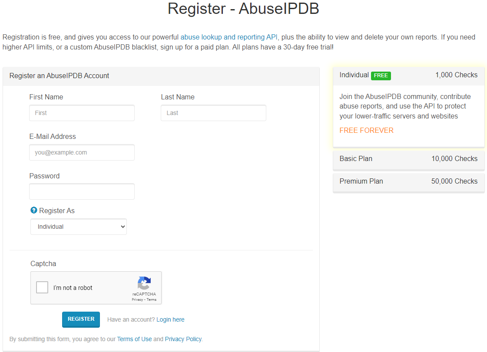
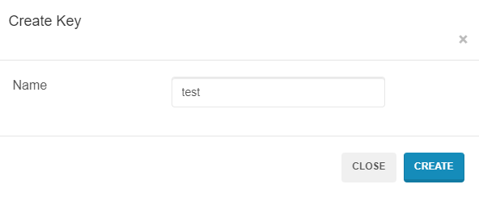
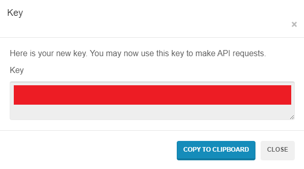

# SIEM OSINT Automation Project (SOAP)

SOAP is a collection of Python scripts that can be used to automate various OSINT tasks based on data from SIEMs. This helps improve response time and efficiency in incident response and threat hunting. These scripts are designed to work based on data outputted by SIEMs, such as IP addresses, domains, and hashes, rather than directly interfacing with the SIEM itself.

## Requirements

This project was tested on Python 3.12.3.

- Python 3.12+
- VirusTotal API key (free tier is sufficient)
- ipinfo.io API key (free tier is sufficient)
- AbuseIPDB API key (free tier is sufficient)
- secrets.json file containing API keys

## How to Get API Keys

### VirusTotal

1. Register for a free VirusTotal account: [https://www.virustotal.com/gui/join-us](https://www.virustotal.com/gui/join-us).


2. Once logged in, click on the top-right corner where your profile icon is and select "API Key". This will direct you to the [API Key page](https://www.virustotal.com/gui/my-apikey).


3. Under API Key, click on "Copy to clipboard" to copy your API key


### ipinfo.io

1. Register for a free IPinfo account: [https://ipinfo.io/signup](https://ipinfo.io/signup).


2. Once logged in and on the [home page](https://ipinfo.io/account/home), scroll down to `Step 3: Get your token`, and click on `Copy` to copy your API key.


### AbuseIPDB

1. Register for a free AbuseIPDB account: [https://www.abuseipdb.com/register?plan=free](https://www.abuseipdb.com/register?plan=free).



2. After registering, log in to your account and navigate to the [API Key page](https://www.abuseipdb.com/account/api). You can create a new API key by clicking on the `Create Key` button under the `Keys` section.



3. Give the key a name, then click on `Create` and the `Copy to Clipboard` button to copy your API key.



### secrets.json

**`Warning`**: Do not share, upload, commit, or otherwise expose your API keys to the public. This can lead to unauthorized access and usage of your API keys. The `secrets.json` file is used to store your API keys in a secure manner, and has been added to the `.gitignore` file to prevent accidental exposure.

1. Create a `secrets.json` file in the root directory of the project with the following format:

```json
{
    "vt_api_key": "YOUR VIRUSTOTAL API KEY",
    "ip_info_api_key": "YOUR IPINFO API KEY",
    "aipdb_key": "YOUR ABUSEIPDB API KEY"
}
```

2. Replace `YOUR VIRUSTOTAL API KEY`, `YOUR IPINFO API KEY`, `YOUR ABUSEIPDB API KEY` with the respective API keys you obtained in the previous steps.

3. Ensure that the `secrets.json` file is in the root directory of the project.

## File Structure

I assume the following file structure:

```plaintext
.
├───.venv
├───.gitignore
├───README.md
├───requirements.txt
├───LICENSE
├───common
│   ├───helper_functions.py
│   └───__init__.py
├───ip_osint_json
│   ├───vt_ip_lookup.json (Output from vt_ip_osint.py)
│   ├───ii_ip_lookup.json (Output from ii_ip_osint.py)
│   ├───ai_ip_lookup.json (Output from ai_ip_osint.py)
│   ├───vt_file_lookup.json (Output from vt_file_osint.py)
│   └───vt_domain_lookup.json (Output from vt_domain_osint.py)
├───vt_ip_osint.py
├───ii_ip_osint.py
├───ai_ip_osint.py
├───vt_file_osint.py
├───vt_domain_osint.py
├───comment.py
└───secrets.json
```

## Installation

1. Clone the repository:

```bash
git clone https://github.com/NicholasChua/siem_osint_automation.git
```

2. Create a virtual environment in the root directory of the project:

For Unix/Linux/MacOS:

```bash
python -m venv .venv
source .venv/bin/activate
```

For Windows:

```plaintext
python -m venv .venv
.\.venv\Scripts\activate
```

3. Install the required Python packages:

```bash
pip install -r requirements.txt
```

4. Ensure your file structure matches the file structure listed in the [File Structure](#file-structure) section.

## Usage

### `vt_ip_osint.py`

This script takes in an IP address as input and queries VirusTotal for information on the IP address. The script then outputs the response to a .json file. The file is then further processed to extract relevant information (e.g. which vendors consider it malicious) and return it to the user.

```bash
python vt_ip_osint.py --ip 8.8.8.8
```

The script will output `vt_ip_lookup.json` file in the `ip_osint_json` directory if the user wishes to look at the full VirusTotal response. Note that the output file is overwritten each time the script is run.

Example Output:

```plaintext
IP Address: 8.8.8.8
No VT vendors detected this IP Address as malicious.
VT vendors that detected this IP Address as malicious: 0/92
```

### `ii_ip_osint.py`

This script takes in an IP address as input and queries ipinfo.io for information on the IP address. The script then outputs the response to a .json file. The file is then further processed to extract relevant information (e.g. city, region, org, country) and return it to the user.

```bash
python ii_ip_osint.py --ip 8.8.8.8
```

The script will output `ii_ip_lookup.json` file in the `ip_osint_json` directory if the user wishes to look at the full ipinfo.io response. Note that the output file is overwritten each time the script is run.

Example Output:

```plaintext
IP Address: 8.8.8.8
City: Mountain View
Region: California
Organization: AS15169 Google LLC
Country: United States
```

### `ai_ip_osint.py`

This script takes in an IP address as input and queries AbuseIPDB for information on the IP address. The script then outputs the response to a .json file. The file is then further processed to extract relevant information (e.g. IP address, number of reports, abuse confidence score, country code) and return it to the user.

```bash
python ai_ip_osint.py --ip 8.8.8.8
```

The script will output `ai_ip_lookup.json` file in the `ip_osint_json` directory if the user wishes to look at the full AbuseIPDB response. Note that the output file is overwritten each time the script is run.

Example Output:

```plaintext
IP Address: 8.8.8.8
Abuse Confidence Score: 0
Is Tor: False
```

### `vt_file_osint.py`

This script takes in a file or a file hash as input and queries VirusTotal for information on the file or file hash. The script then outputs the response to a .json file. The file is then further processed to extract relevant information (e.g. threat label, file type, which vendors consider it malicious) and return it to the user.

```bash
python vt_file_osint.py --malware_file malware.exe
python vt_file_osint.py --malware_hash fb55414848281f804858ce188c3dc659d129e283bd62d58d34f6e6f568feab37
```

Example Output:

```plaintext
Threat Label: hacktool.mimikatz/hacktoolx
File Type: Win32 EXE
Last Analysis Date: 2024-08-11T20:00:58
The following VT vendors detected this file as malicious: Bkav, Lionic, Elastic, MicroWorld-eScan, CAT-QuickHeal, Skyhigh, ALYac, Cylance, Zillya, Sangfor, K7AntiVirus, Alibaba, K7GW, Cybereason, Arcabit, huorong, Symantec, ESET-NOD32, APEX, TrendMicro-HouseCall, Paloalto, ClamAV, Kaspersky, BitDefender, NANO-Antivirus, SUPERAntiSpyware, Avast, Tencent, Emsisoft, Google, DrWeb, VIPRE, TrendMicro, McAfeeD, Trapmine, FireEye, Sophos, Ikarus, Jiangmin, Webroot, Varist, Antiy-AVL, Kingsoft, Gridinsoft, Xcitium, Microsoft, ViRobot, ZoneAlarm, GData, Cynet, AhnLab-V3, McAfee, MAX, VBA32, Malwarebytes, Panda, Rising, Yandex, SentinelOne, MaxSecure, Fortinet, AVG, DeepInstinct, CrowdStrike, alibabacloud
VT vendors that detected this file as malicious: 65/79
```

The script will output `vt_file_lookup.json` file in the `ip_osint_json` directory if the user wishes to look at the full VirusTotal response. Note that the output file is overwritten each time the script is run.

### `vt_domain_osint.py`

This script takes in a domain as input and queries VirusTotal for information on the domain. The script then outputs the response to a .json file. The file is then further processed to extract relevant information (e.g. IP addresses, alternate domains, which vendors consider it malicious) and return it to the user.

```bash
python vt_domain_osint.py -d polyfill.io
```

Example Output:

```plaintext
Domain: polyfill.io
Last Analysis Date: 2024-08-15T15:35:37
IPv4 Addresses: 104.21.18.249, 172.67.184.69
IPv6 Addresses: 2606:4700:3031::6815:12f9, 2606:4700:3037::ac43:b845
Alternate Domains: polyfill.io.cdn.cloudflare.net
The following VT vendors detected this domain as malicious: alphaMountain.ai, Bfore.Ai PreCrime, CyRadar, Dr.Web, ESTsecurity, Emsisoft, Fortinet, Lionic, Sansec eComscan, Seclookup, Webroot   
Number of vendors that detected this domain as malicious: 11/93
```

The script will output `vt_domain_lookup.json` file in the `ip_osint_json` directory if the user wishes to look at the full VirusTotal response. Note that the output file is overwritten each time the script is run.

### `comment.py`

This script is essentially a template for combining the `vt_ip_osint.py`, `ii_ip_osint.py`, `ai_ip_osint.py`, `vt_file_osint.py` and `vt_domain_osint.py` scripts together, and generating a series of comments. The script takes in an IP address, malware file or hash, or domain as input and generates a comment based on the output of the three scripts.

As this script uses the functions of the other scripts, it also generates the `vt_ip_lookup.json`, `ii_ip_lookup.json`, and `ai_ip_lookup.json` files in the `ip_osint_json` directory. Note that the output files are overwritten each time the script is run.

```bash
python comment.py --ip 8.8.8.8
python comment.py --malware_file malware.exe
python comment.py --malware_hash fb55414848281f804858ce188c3dc659d129e283bd62d58d34f6e6f568feab37
python comment.py -d polyfill.io
```

Example Output:

```plaintext
SOAP_auto_analysis:
- Analyzed at 2024-07-18T09:31:19.506173+08:00.
- VirusTotal Link: https://www.virustotal.com/gui/ip-address/8.8.8.8
- IP is clean in VirusTotal.
- ipinfo Link: https://ipinfo.io/8.8.8.8
- IP Geolocation is in country United States, region California, city Mountain View.
- IP belongs to: AS15169 Google LLC
- AbuseIPDB Link: https://www.abuseipdb.com/check/8.8.8.8
- Abuse Confidence Score: 0
- IP is not a Tor exit node.
```

```plaintext
SOAP_auto_analysis:
- Analyzed at 2024-08-26T11:20:33.845629+08:00.
- VirusTotal Link: https://www.virustotal.com/gui/file/('fb55414848281f804858ce188c3dc659d129e283bd62d58d34f6e6f568feab37',)
- Threat Label: hacktool.mimikatz/hacktoolx
- File Type: Win32 EXE
- File flagged as potential threat by 64/79 VirusTotal vendors: Lionic, AVG, DrWeb, MicroWorld-eScan, FireEye, CAT-QuickHeal, Skyhigh, McAfee, Malwarebytes, VIPRE, Sangfor, CrowdStrike, Alibaba, K7GW, K7AntiVirus, Symantec, Elastic, ESET-NOD32, Cynet, APEX, Paloalto, ClamAV, Kaspersky, BitDefender, NANO-Antivirus, SUPERAntiSpyware, Avast, Tencent, Emsisoft, Zillya, TrendMicro, McAfeeD, SentinelOne, Trapmine, Sophos, Ikarus, Jiangmin, Webroot, Google, Antiy-AVL, Kingsoft, Microsoft, Gridinsoft, Xcitium, Arcabit, ViRobot, ZoneAlarm, GData, Varist, AhnLab-V3, ALYac, MAX, VBA32, Cylance, Panda, TrendMicro-HouseCall, Rising, Yandex, huorong, MaxSecure, Fortinet, Cybereason, DeepInstinct, alibabacloud
```

```plaintext
SOAP_auto_analysis:
- Analyzed at 2024-08-26T11:20:41.232520+08:00.
- VirusTotal Link: https://www.virustotal.com/gui/domain/polyfill.io
- IPv4 Addresses: 104.21.18.249, 172.67.184.69
- IPv6 Addresses: 2606:4700:3031::6815:12f9, 2606:4700:3037::ac43:b845
- Alternate Domains: polyfill.io.cdn.cloudflare.net
- Domain flagged as potential threat by 11/94 VirusTotal vendors: alphaMountain.ai, Bfore.Ai PreCrime, CyRadar, Dr.Web, ESTsecurity, Emsisoft, Fortinet, Lionic, Sansec eComscan, Seclookup, Webroot
```

## Video Demo

Recorded as at commit `ba388b8888f4517ec2c6791f978daadc021cbb22`.

[](https://www.youtube.com/watch?v=DuhtSVKlpxA)

## To Do

- [x] Implement VirusTotal IP Lookup script via API
- [x] Implement ipinfo.io IP Lookup script via API
- [x] Automated comment generation for each script (i.e. timestamp, IP address, etc.)
- [x] Main file to run all scripts together
- [x] Implement AbuseIPDB IP Reputation Lookup script via API
- [x] Implement VirusTotal File Lookup script via API
- [x] Implement VirusTotal Domain Lookup script via API

## Not Feasible

- [ ] Implement Cisco Talos IP Reputation Lookup script via web scraping (no API, uses Cloudflare protection)
- [ ] Implement IBM X-Force IP Reputation Lookup script via web scraping (API only lasts for 30 days)
- [ ] Implement haveibeenpwned.com Email Lookup script via API (cost)

## Excluded

- [ ] SIEM integration (not public)
- [ ] Excel user attributes query (not public)
